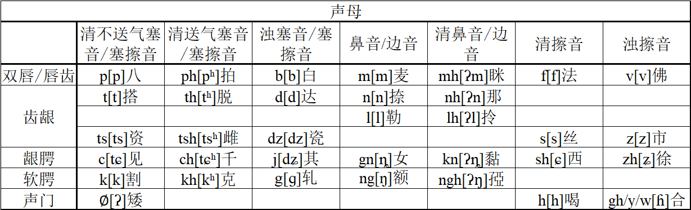

## 声母表

## 清浊音

学习宁波话的声母最重要的就是分清楚清浊声母。普通话中只有鼻音、边音、近音有浊音。宁波话中所有类型的声母都可以分为清音和浊音，其中塞音和塞擦音更是可以分为不送气清音，送气清音和浊音。所以宁波话较普通话要多出好几个声母。

以双唇和唇齿位置的声母为例。其中p是清不送气塞音，ph是清送气塞音，b是浊塞音，m是鼻音，mh是清鼻音，f是清擦音，v是浊擦音。相较普通话多了浊塞音b和浊擦音v，还区分了清浊鼻音。与普通话的对比如下：

|   声母类型   | IPA（国际音标） | 宁波话（吴拼） | 普通话（汉语拼音） |
| :----------: | :-------------: | :------------: | :----------------: |
| 清不送气塞音 |        p        |       p        |         b          |
|  清送气塞音  |       pʰ        |       ph       |         p          |
|    浊塞音    |        b        |     **b**      |         无         |
|     鼻音     |        m        |       m        |         m          |
|    清鼻音    |       ʔm        |     **mh**     |         无         |
|    清擦音    |        f        |       f        |         f          |
|    浊擦音    |        v        |     **v**      |         无         |

先不管鼻音和擦音，关注到塞音类。吴拼的声母p和ph分别对应汉语拼音的b和p，而吴拼的b代表普通话中不存在的浊音b。浊音b的发音和不同于汉语拼音的b，而是接近英语中的b。初学者很可能会对此感到困惑，很难适应这样的拼写。但这样的拼写能够提醒使用者去注意清浊音的不同。读者可以看一下下面每个声母的例字，体会一下清浊声母的不同。理解了清浊声母的概念，就能掌握好吴拼的声母。

## p ph b m f v

### p

声母p是清不送气双唇塞音，IPA（国际音标）：\[p\]。

宁波话中声母p的发音与普通话中的声母b相同。

例字：

边pi1，布pu5，拜pa5，包pau1，疤po1，表piau3，班pae1，杯pei1，玻pou1，绷pan1，帮paon1，搬pun1，本pen3，冰pin1，八paq7，北poq7，笔piq7。

### ph

声母ph是清送气双唇塞音，IPA：\[pʰ\]。

宁波话中声母ph的发音与普通话中的声母p相同。

例字：

偏phi1，普phu3，派pha5，抛phau1，怕pho5，飘phiau1，攀phae1，坯phei1，坡phou1，乓phan1，胖phaon5，潘phun1，喷phen1，拼phin1，捧phon3，拍phaq7，扑phoq7，劈phiq7。

### b

声母b是浊双唇塞音，IPA：\[b\]。

宁波话中声母b是与p相同发音部位的浊音，发音与英语中的辅音/b/类似。普通话中没有与它发音相同的声母。注意不要与声母p混淆。

例字：

皮bi2，菩bu2，排ba2，抱bau6，爬bo2，瓢biau2，办bae6，备bei6，婆bou2，朋ban2，旁baon2，盘bun2，盆ben2，病bin6，塳bon2，白baq8，薄boq8，别biq8。

### m

声母m是双唇鼻音，IPA：\[m\]。

宁波话中声母m的发音与普通话中的声母m相同。另外它也可以作为一个自成音节的韵母，这点会在韵母章节介绍。

例字：

棉mi2，毛mau2，麻mo2，秒miau6，慢mae6，梅mei2，幕mou6，眸meu2，man6，忙maon2，满mun6，门men2，命min6，懵mon2，麦maq8，木moq8，灭miq8。

### f

声母f是清唇齿擦音，IPA：\[f\]。

宁波话中声母f的发音与普通话中的声母f相同。

例字：

飞fi1，富fu5，反fae3，否feu3，方faon1，芬fen1，封fon1，发faq7，福foq7。

### v

声母v是浊唇齿擦音，IPA：\[v\]。

宁波话中声母v是与f相同发音部位的浊音，发音与英语中的辅音/v/相同。

例字：

维vi2，符vu2，饭vae6，房vaon2，文ven2，奉von6，罚vaq8，服voq8。

## t th d n l

### t

声母t是清不送气齿龈塞音，IPA：\[t\]。

宁波话中声母t的发音与普通话中的声母d相同。

例字：

底ti3，赌tu3，带ta5，爹tia1，岛tau3，躲to3，吊tiau5，单tae1，丢tieu1，短toe3，堆tei1，多tou1，兜teu1，打tan3，档taon5，灯ten1，丁tin1，东ton1，德taq7，笃toq7，嫡tiq7。

### th

声母th是清送气齿龈塞音，IPA：\[tʰ\]。

宁波话中声母th的发音与普通话中的声母t相同。

例字：

天thi1，土thu3，太tha5，套thau5，跳thiau5，胎the1，摊thae1，彖thoe1，腿thei3，拖thou1，偷theu1，汤thaon1，吞then1，听thin1，痛thon5，塔thaq7，托thoq7，踢thiq7。

### d

声母d是浊齿龈塞音，IPA：\[d\]。

宁波话中声母d是与t相同发音部位的浊音，发音与英语中的辅音/d/类似。普通话中没有与它发音相同的声母。注意不要与声母t混淆。

例字：

田di2，图du2，𢪂da6，逃dau2，条diau2，抬de2，蛋dae6，断doe6，队dei6，驮dou2，头deu2，糖daon2，藤den2，亭din2，同don2，踏daq8，碟diaq8，读doq8，笛diq8。

### n

声母n是齿龈鼻音，IPA：\[n\]。

宁波话中声母n的发音与普通话中的声母n相同。另外它也可以作为一个自成音节的韵母，这点会在韵母章节介绍。

例字：

努nu6，奶na6，脑nau6，挪no6，念ne6，难nae2，暖noe6，内nei6，糯nou6，囊naon6，嫩nen6，农non2，纳naq8，诺noq8。

### l

声母l是浊齿龈边音，IPA：\[l\]。

宁波话中声母l的发音与普通话中的声母l相同。

例字：

里li6，路lu6，赖la6，老lau6，料liau6，来le2，蓝lae2，流lieu2，乱loe6，雷lei2，罗lou2，漏leu6，冷lan6，亮lian6，廊laon2，轮len2，零lin2，龙lon2，蜡laq8，略liaq8，六loq8，力liq8。

## ts tsh dz s z

### ts

声母ts是清不送气齿龈塞擦音，IPA：\[ts\]。

宁波话中声母ts的发音与普通话中的声母z相同。

例字：

紫tsy3，主tsyu3，租tsu1，债tsa1，早tsau3，渣tso1，灾tse1，盏tsae3，砖tsoe1，追tsei1，做tsou5，走tseu3，争tsan1，装tsaon1，筝tsen1，准tsyun3，钟tson1，扎tsaq7，粥tsoq7，拙tsyuq7。

### tsh

声母tsh是清送气齿龈塞擦音，IPA：\[tsʰ\]。

宁波话中声母tsh的发音与普通话中的声母c相同。

例字：

刺tshy5，取tshyu3，粗tshu1，蔡tsha5，草tshau3，车tsho1，猜tshe1，餐tshae5，穿tshoe1，摧tshei1，错tshou5，凑tsheu5，撑tshan1，窗tshaon1，衬tshen5，春tshyun1，葱tshon1，尺tshaq7，触tshyuq7，出tshyuq7。

### dz

声母dz是浊齿龈塞擦音，IPA：\[dz\]。

宁波话中声母dz是与ts相同发音部位的浊音，发音与英语单词birds中的ds发音类似。普通话中没有与它发音相同的声母。注意不要与声母ts混淆。

例字：

慈dzy2，除dzyu2，助dzu2，曹dzau2，茶dzo2，才dze2，赚dzae6，全dzoe2，锃dzan6，撞dzaon6，存dzen2，虫dzon2，择dzaq8，逐dzoq8，绝dzyuq8。

### s

声母s是清齿龈擦音，IPA：\[s\]。

宁波话中声母s的发音与普通话中的声母s相同。

例字：

四sy5，书syu1，苏su1，晒sa5，扫sau3，纱so1，腮se1，山sae1，酸soe1，碎sei5，锁sou3，瘦seu5，甥san1，双saon1，孙sen1，笋syun3，松son1，煞saq7，速soq7，刷syuq7。

### z

声母z是浊齿龈擦音，IPA：\[z\]。

宁波话中声母z是与s相同发音部位的浊音，发音与英语中的辅音/z/相同。

例字：

字zy6，树zyu6，柴za2，槽zau2，惹zo6，裁ze2，僝zae6，船zoe2，随zei2，坐zou6，愁zeu2，上zaon6，层zen2，纯zyun2，闸zaq8，熟zoq8，十zyuq8。

## c ch j gn sh zh

### c

声母c是清不送气龈腭塞擦音，IPA：\[tɕ\]。

宁波话中声母c的发音与普通话中的声母j相同。

例字：

记ci5，句ciu5，姐cia3，照ciau5，九cieu3，姜cian1，针cin1，君ciun1，炯cion3，脚ciaq7，结ciq7，菊ciuq7。

### ch

声母ch是清送气龈腭塞擦音，IPA：\[tɕʰ\]。

宁波话中声母ch的发音与普通话中的声母q相同。

例字：

气chi5，区chiu1，笡chia3，巧chiau3，臭chieu5，厂chian3，亲chin1，菌chiun5，鹊chiaq7，吃chioq7，七chiq7，缺chiuq7。

### j

声母j是浊龈腭塞擦音，IPA：\[dʑ\]。

宁波话中声母j是与c相同发音部位的浊音，普通话和英语中都没有与它相同的辅音。注意不要与声母c混淆。

例字：

棋ji2，拳jiu6，茄jia2，潮jiau2，球jieu2，丈jian6，城jin2，裙jiun2，穷jion2，直jiq8，局jiuq8。

### gn

声母gn是龈腭鼻音，IPA：\[ȵ\]。

宁波话中声母gn是与c相同发音部位的鼻音，与普通话“泥”字的声母发音相似。

读者其实可以不必在意声母gn和n的区别，因为在宁波话中两者呈互补分布。声母gn只能接韵母i或i介音，声母n不能接韵母i和i介音。在输入法中gn也可以拼作n。

例字：

泥gni2，女gniu2，绕gniau6，钮gnieu6，娘gnian2，鄞gnin2，绒gnion2，捏gniaq8，玉gnioq8，热gniq8。

### sh

声母sh是清龈腭擦音，IPA：\[ɕ\]。

宁波话中声母s的发音与普通话中的声母x相同。

例字：

西shi1，虚shiu1，写shia3，小shiau3，修shieu1，向shian5，心shin1，熏shiun1，凶shion1，削shiaq7，吸shiq7，血shiuq7。

### zh

声母zh是浊龈腭擦音，IPA：\[ʑ\]。

宁波话中声母zh是与sh相同发音部位的浊音，普通话和英语中都没有与它相同的辅音。

例字：

徐zhi2，谢zhia6，绍zhiau6，受zhieu6，墙zhian2，寻zhin2，嚼zhiaq8，舌zhiq8。

## k kh g ng

### k

声母k是清不送气软腭塞音，IPA：\[k\]。

宁波话中声母k的发音与普通话中的声母g相同。

例字：

赶ki3，姑ku1，街ka1，怪kua5，高kau1，嫁ko5，瓜kuo1，改ke3，减kae3，关kuae1，规kuei1，歌kou1，狗keu3，羹kan1，挭kuan1，缸kaon1，广kuaon3，管kun3，跟ken1，滚kuen3，工kon1，隔kaq7，骨kuaq7，谷koq7。

### kh

声母kh是清送气软腭塞音，IPA：\[kʰ\]。

宁波话中声母kh的发音与普通话中的声母k相同。

例字：

看khi5，苦khu3，卡kha3，快khua5，考khau3，抲kho5，夸khuo1，开khe1，铅khae1，盔khuei1，棵khou1，口kheu1，坑khan1，康khaon1，筐khuaon1，宽khun1，啃khen3，困khuen5，恐khon3，客khaq7，阔khuaq7，哭khoq7。

### g

声母g是浊软腭塞音，IPA：\[ɡ\]。

宁波话中声母g是与k相同发音部位的浊音，发音与英语中的辅音/g/类似。普通话中没有与它发音相同的声母。注意不要与声母k混淆。

例字：

绞gau6，谏gae6，掼guae6，葵guei2，鲠gan6，戆gaon6，狂guaon2，艮gen6，共gon6，轧gaq8。

### ng

声母ng是软腭鼻音，IPA：\[ŋ\]。

宁波话中声母ng是与k相同发音部位的鼻音，与普通话后鼻音韵尾的发音相似，在宁波话中它可以作为声母。另外它也可以作为一个自成音节的韵母，这点会在韵母章节介绍。

例字：

外nga6，咬ngau6，牙ngo2，岸nge2，眼ngae6，鹅ngou2，牛ngeu2，硬ngan6，昂ngaon2，额ngaq8，鹤ngoq8。

## 零声母 h gh

### ∅

零声母即没有声母，表格中使用符号∅来表示零声母，但在实际打字和注音的时候不需要写出来。

宁波话里发零声母的时候会有轻微的喉塞音\[ʔ\]。

例字：

衣i1，乌u1，鸳iu1，啊a1，亚ia5，娃ua1，袄au3，哑o3，要iau5，蛙uo1，爱e5，晏ae5，弯uae1，优ieu1，安ei1，威uei1，窝ou1，欧eu1，㹙an1，央ian1，肮aon1，汪uaon1，碗un3，恩en1，阴in1，温uen1，蕴iun1，翁on1，甬ion3，压aq7，约iaq7，挖uaq7，屋oq7，一iq7，郁iuq7。

### h

声母h是清声门擦音，IPA：\[h\]。

宁波话中声母h的发音与普通话中的声母h类似，但发音部位更靠后一些，气流直接从声带出来，与英语中的辅音/h/相同。

例字：

蟹ha3，歪hua3，耗hau5，化huo5，海he3，喊hae1，灰huei1，火hou3，齁heu1，亨han1，荒huaon1，欢hun1，狠hen3，荤huen1，烘hon1，黑haq7，豁huaq7，霍hoq7。

### gh/y/w

声母gh是浊声门擦音，IPA：\[ɦ\]。

宁波话中声母gh是与h相同发音部位的浊音，普通话和英语中都没有与它相同的辅音。

声母gh后面接韵母i或i介音时，简写为yi或y。如“盐”拼为yi2，“油”拼为yeu2。后面接韵母iu或iu介音时，简写为yu。如“圆”拼为yu2，“云”拼为yun2。后面接韵母u或u介音时，简写为wu或w。如“胡”拼为wu2，“回”拼为wei2。

例字：

盐yi2，胡wu2，圆yu2，鞋gha2，野ya6，毫ghau2，下gho6，摇yau2，话wo6，害ghe6，馅ghae6，环wae2，油yeu2，汗ghei6，回wei2，河ghou2，猴gheu2，洋yan2，横wan2，航ghaon6，黄waon2，完wun2，恨ghen6，形yin2，浑wen2，云yun2，红ghon2，用yon6，盒ghaq8，药yaq8，滑waq8，或ghoq，页yiq8，越yuq8。

## 清鼻音边音声母

宁波话的鼻音和边音也可以分清浊。虽然许多资料中并不区分这两者，但我们仍将它们分开来。两者最显著的区别是它们所辖的字的声调不同。读者也可不必不在意这两者的差别，在输入法中可以使用浊鼻音边音声母的拼写来打出下面这些字。

### mh

声母mh是声母m相对应的清音，发音时有轻微的喉塞音\[ʔ\]。IPA：\[ʔm\]

例字：

眯mhi5，妈mha5，嬷mho1，咩mhae5，焖mhen5。

### nh

声母nh是声母n相对应的清音，发音时有轻微的喉塞音\[ʔ\]。IPA：\[ʔn\]

例字：

那nha5，齈nhon5。

### lh

声母lh是声母l相对应的清音，发音时有轻微的喉塞音\[ʔ\]。IPA：\[ʔl\]

例字：

哩lhi5，拉lha1，捞lhau1，啰lhou5，镂lheu1，哴lhaon5，拎lhin1，睩lhoq7。

### kn

声母kn是声母gn相对应的清音，发音时有轻微的喉塞音\[ʔ\]。IPA：\[ʔȵ\]

例字：

黏kni1，扭khieu1。

### ngh

声母ngh是声母ng相对应的清音，发音时有轻微的喉塞音\[ʔ\]。IPA：\[ʔŋ\]

例字：

扤摇动；晃动nghaq7。
