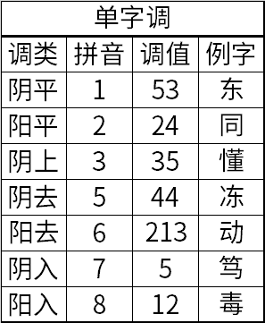

## 单字调

单字调指一个字能拿出来单独说时的声调。宁波话有连读变调，一个字在词语中的声调和单独说时会有不同。

宁波话的声调正处在快速归并的过程当中，单字调的个数也因人而异，在5个到7个不等。不同人的合并情况也有不同。又有许多字在口语里总是组成词，很少单独说，这些字的单字调也很难确定，不同人之间可能出现很大的分歧。且宁波话存在普遍的“窜调”现象，即一个字的单字调读入别的调类。

教程这里以老派的7个单字调为例，且都是举能单独说的字。

老派宁波话有7个单字调，阴平、阳平、阴上、阴去、阳去、阴入以及阳入。分别用1、2、3、5、6、7、8来表示。读者可能注意到了，宁波话没有阳上声调，那是因为阳上声调并入了阳去声调。

宁波话的声调分为阴阳。1、3、5、7这四个声调是阴调，2、6、8这三个声调是阳调。宁波话的声母与单字调有关，清音声母的字只能是阴调，浊音声母的字只能是阳调。

宁波话的声调又分舒入。平上去这三类声调统称舒声，剩下的阴入和阳入统称入声。入声调只能用在入声韵的字上，发音时较短促。

## 1. 阴平

宁波话的阴平声调的调值为53。

这里的数字53，是用五度标调法标的调值。读者可以类比为简谱中的音符。5相当于一个高的音调，3相当于一个不高不低的音调。53表示从高的音下降到中的音。例如普通话中第四声的调值是51，一个下降的声调。宁波话的阴平类似普通话的第四声，只是下降地没有那么厉害。

例字：

天thi1，高kau1，三sae1，香shian1，听shin1，东ton1。

## 2. 阳平

宁波话的阳平声调的调值为24。

类似普通话中第二声的调值是35，一个上升的声调。但宁波话的阳平更低沉一些。

例字：

毛mau2，爿bae2，来le2，头deu2，牛ngeu2，油yeu2，同don2，零lin2。

## 3. 阴上

宁波话的阴上声调的调值为35。

与普通话中第二声35一样，一个上升的声调。比先前提到的阳平的音调更高一些。

例字：

纸tsy3，古ku3，采tshe3，火hou3，口kheu3，九cieu3，讲kaon3，饼pin3，懂ton3。

## 5. 阴去

宁波话的阴去声调的调值为44。

类似普通话中的第一声55，一个平调。但比普通话的第一声稍低沉一些。

一部分新派阴去并入阴平。

例字：

四sy5，变pi5，派pha5，借cia5，到tau5，做tsou5，货hou5，壮tsaon5，冻ton5。

## \*6. 阳去

宁波话的阳去声调的调值为213。

类似普通话中的第三声214，一个转折调。

新派口音中，阳去已经并入了阳平。

例字：

里li6，夜ya6，老lau6，我ngo6，话wo6，猛man6，亮lian6，近jin6，五ng6。

## 7. 阴入

宁波话的阴入声调的调值为5。

一个短促的高调。

入声调只用于入声韵，阴调也只用于清声母，所以只需看声母和韵尾就能判断一个字是不是阴入调。

例字：

八paq7，脚ciaq7，刮kuaq7，福foq7，速soq7，笔piq7，曲chiuq7，出tshyuq7。

## 8. 阳入

宁波话的阳入声调的调值为<u>12</u>。

严格书写，12下方要加下划线，表示这个声调很短促。宁波话的阳入声调是个短促的低调，略微上升。

入声调只用于入声韵，阳调也只用于浊声母，所以只需看声母和韵尾就能判断一个字是不是阳入调。

例字：

拔baq8，药yaq8，活waq8，六loq8，肉gnioq8，热gniq8，月yuq8，十zyuq8。