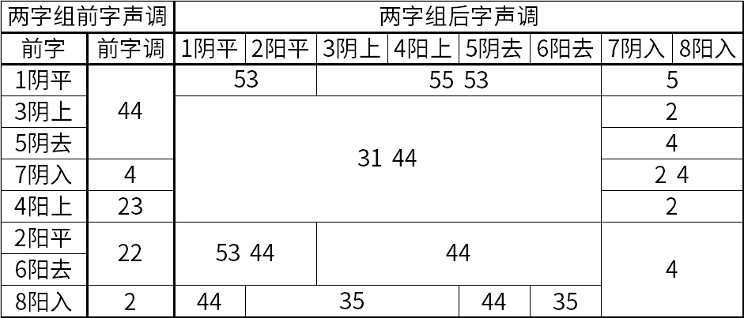

## 连读变调

宁波话有连读变调，一个字的声调在词语中会发生变化。宁波话的连读变调比较复杂，在拼音方案里没有标多字调方法，如果一定要标变调的话，可以直接用五度标调法的数字来表示。

由于变调的复杂性，不同的资料有不同的记录，不同人在说同一个词语的时候变调也可能不同。下面的表格是老派宁波话的两字组变调，参照了江苏教育版《寧波方言詞典》的引言和正文。最左列是前字的调类，第二列是变调时前字的声调，用五度标调法表示。后面几列是两字组后字的声调。有些组合后字有两种可能的声调。

阴调类在前字位置读 44（舒声）和 4（入声），阳调除阳上外在前字位置读 22（舒声）和 2（入声）。注意到在单字调里，阳上并入了阳去。但在连读变调中，阳上在前字位置读作 23，不同于阳平和阳去的 22。对比“两度” lian23 du31和“亮度” lian22 du31。

除了前字为阳入的情况外，后字位置不分阴阳调，只区分平上去入。

下面举一些例子。

阴平+平：乌青 u44 chin53，金黄 cin44 waon53

阴平+上、去：舢板 sae44 pae55，花絮 huo44 shi55，方便 faon44 bi55，推板 tei44 pae53，番薯 fae44 zyu53，兄弟 shion44 di53

阴平+入：心急 shin44 ciq5，生日 san44 gniq5

阳平+平：梅花 mei22 huo53，蚊虫 men22 dzon53，农村 non22 tshen44，团圆 doe22 yu44

阳平+上、去：门口 men22 kheu44，牛奶 ngeu22 na44，难看 nae22 khi44，长寿 jian22 zhieu44

阳平+入：头发 deu22 faq4，茶叶 dzo22 yiq4

阴上+舒：小气 shiau44 chi31，苦头 khu44 deu31，稿纸 kau44 tsy31，考试 kau44 sy31，姊妹 ci44 mei31，表演 piau44 yi31，广场 kuaon44 jian44，好像 hau44 zhian44，考虑 khau44 li44

阴上+入：粉笔 fen44 piq2，水闸 syu44 zaq2

阳上+舒：淡包 dae23 pau31，象棋 zhian23 ji31，稻草 tau23 tshau31，电脑 di23 nau31，马路 mo23 lu31，雨衣 yu23 i44，项圈 ghaon23 chiu44，米桶 mi23 don44

阳上+入：米色 mi23 saq2，每日 mei23 gniq2

阴去+舒：酱油 cian44 yeu44，戏文 shi44 ven44，细巧 shi44 chiau44，看护 khi44 wu44，苋菜 hae44 tshe44，告示 kau44 zy44，看张 khi44 cian31，衬头 tshen44 deu31，兔子 thu44 tsy31

阴去+入：记得 ci44 taq4，快活 khua44 waq4

阳去+平：自家 zhi22 ko44，外婆 nga22 bou44，汗衫 ghei22 sae53，大红 da22 ghon53

阳去+上、去：地板 di22 pae44，地壤 di22 gnian44，饭店 vae22 ti44，大字 da22 zy44

阳去+入：闹热 nau22 gniq4，腐竹 vu22 tsoq4

阴入+舒：黑心 haq4 shin31，足球 tsoq4 jieu31，铁轨 thiq4 kuei31，结棍 ciq4 kuen31，八千 paq4 chi44，壳子 khoq4 tsy44，桌凳 tsoq4 ten44

阴入+入：百脚 paq4 ciaq2，八十 paq4 zyuq2，压末 aq4 maq4

阳入+阴平、阴去：薄刀 boq2 tau44，药店 yaq2 ti44

阳入+阳平、上声、阳去：钥匙 yaq2 zy35，席子 zhiq2 tsy35，木耳 moq2 er35，月亮 yuq2 lian35

阳入+入：服帖 voq2 thiaq4，日脚 gniq2 ciaq4

另外，在动宾式短语中，后字不变调，前字阴调变为 33（舒声）和 3（入声），阳调变为 22（舒声）和 2（入声）。例如：剃头 thi33 deu24，游河 yeu22 ghou24。

