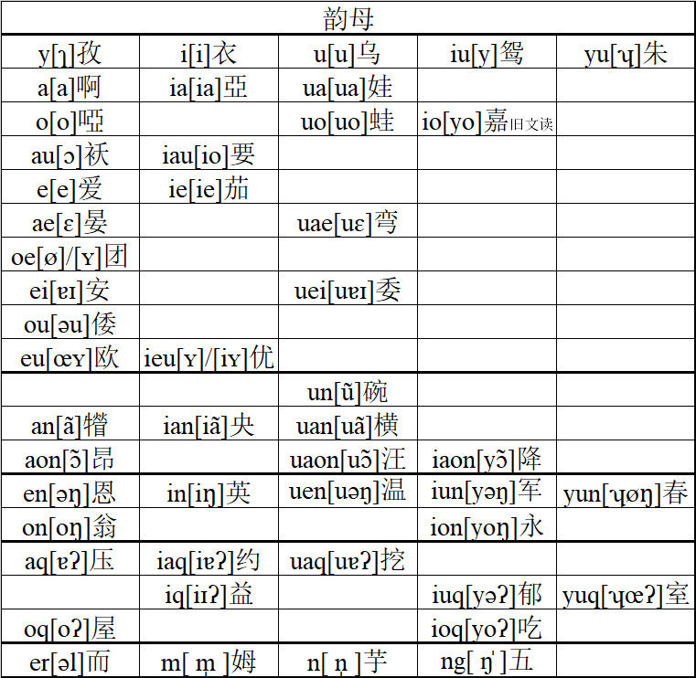

## 韵母表

## 口韵母

### y

发音与普通话中“思”字的韵母相同。IPA（国际音标）：\[ɿ\]。

例字：

籽tsy3，次tshy5，辞dzy2，丝sy1，是zy6。

### yu

发音部位与韵母y相同，发音时嘴唇撮成圆形。IPA：\[ʮ\]。

注意区分韵母yu和音节yu。

例字：

嘴tsyu3，趣tshyu5，厨dzyu2，输syu1，竖zyu6。

### i

发音与普通话中的韵母i相同。IPA：\[i\]。

例字：

比pi3，屁phi5，疲bi2，面mi6，肺fi5，唯vi2，低ti1，剃thi5，电di6，连li2，尖ci1，签chi1，骑ji2，年gni2，黏kni1，鲜shi1，徐zhi2，竿ki1，看khi5，姨yi2，医i1。

### u

发音与普通话中的韵母u相同。IPA：\[u\]。

例字：

补pu3，浦phu3，步bu6，斧fu3，雾vu6，都tu1，兔thu5，渡du6，怒nu6，卤lu2，租tsu1，醋tshu5，助dzu2，素su5，古ku3，裤khu5，狐午，污u1。

### iu

发音与普通话中的韵母ü相同。IPA：\[y\]。

例字：

捐ciu1，劝chiu1，权jiu2，愿gniu6，靴shiu1，雨yu6，冤iu6。

### a、ia、ua

发音与普通话中的韵母a、ia、ua相同。IPA：\[a\]、\[ia\]、\[ua\]。

例字：

摆pa3，派pha5，牌ba2，买ma6，泰tha5，𢪂da6，奶na6，那nha5，癞la6，拉lha1，债tsa5，蔡tsha5，晒sa5，柴，街ka1，揩kha1，外nga6，蟹ha3，鞋gha2，矮a3。

借cia5，笡chia3，茄jia2，写shia3，谢zhia6，夜ya6，亚ia5。

怪kua5，快khua5，歪hua3，娃ua1。

### o、\*uo、\*io

o、uo的发音与普通话的o、uo相比，口型略小。在o前加上iu介音，就得到了韵母io的发音。IPA：\[o\]、\[uo\]、\[yo\]。

韵母uo在新派口音里并入了韵母o。只有少部分老派口音中有韵母io，io的发音仅限于“家”、“霞”等字的旧文读，现在均已消失。

例字：

疤po1，怕pho5，爬bo2，马mo6，朵to1，挪no6，遮tso1，叉tsho1，蛇dzo2，所so3，惹zo4，加ko1，抲kho5，瓦ngo4，夏gho6，丫o1。

挂kuo5，跨khuo5，花huo1，画wo6，蛙uo1。

### au、iau

韵母au的发音类似美式英语off中的o，是个单元音，注意不要发成普通话中的ao。韵母iau的发音类似于在au前加上i介音，但iau的au口型更小一些，相当于在韵母o前加上i介音。IPA：\[ɔ\]、\[io\]。

例字：

宝pau3，泡phau5，刨bau2，帽mau6，刀tau1，讨thau3，桃dau2，脑nau6，牢lau2，罩tsau5，糙tshau5，曹dzau2，燥sau5，皂zau2，告kau5，敲khau1，绞gau6，咬ngau6，好hau3，號ghau6，奥au5。

标piau1，票phiau5，瓢biau2，庙miau6，钓tiau1，挑thiau1，调diau2，撩liau2，招ciau1，超chiau1，桥jiau2，绕gniau6，笑shiau5，绍zhiau6，鹞yau2，腰iau1。

### e、\*ie

韵母e的发音类似普通话ei的前半部分和ie的后半部分。与下面要讲的韵母ae相比，口型较小。韵母ie与普通话的ie发音相同。IPA：\[e\]、\[ie\]。

新派口音中韵母ie已经消失，一些字并入了韵母e。

例字：

歹te3，胎the1，代de6，耐ne6，来le2，再tse5，彩tshe3，才dze2，赛se5，裁ze2，盖ke5，开khe1，戤ge6，呆nge2，海he3，孩ghe2，爱e5。

皆cie1，茄jie2，械ye6。

### ae、uae

ae的发音类似美式英语egg中的e，口型比前面的韵母e要大一些。uae即在ae前加上u介音。IPA：\[ɛ\]、\[uɛ\]。

例字：

板pae3，攀phae1，爿bae2，慢mae6，翻fae1，烦vae2，胆tae3，毯thae1，淡dae6，难nae2，篮lae2，赞tsae5，惨tshae3，残dzae2，衫sae1，僝zae6，尴kae5，嵌khae5，岩ngae2，闲ghae2，鸭ae3。

关kuae1，筷khuae5，掼guae6，幻wae2，湾uae1。

### oe

在声母t、th、d、n、nh、l、lh之后，oe的发音为与e同部位的圆唇音，即发音位置与e相同，发音时嘴唇撮成圆形。在声母ts、tsh、dz、s、z之后，发音的口型更小一些。IPA：\[ø\]/\[ʏ\]。

在一些人的口音里，tsoe、tshoe、dzoe、soe、zoe这五类音节，有\[ø\]、\[iʏ\]两种读音。

音节loe经常发作leu。

例字：

端toe1，彖thoe1，段doe6，暖noe6，囡nhoe5，乱loe6，专tsoe1，川tshoe1，泉dzoe2，算soe5，旋zoe2。

### ei、uei

读音类似普通话的ei、ui。IPA：\[ɐɪ\]、\[uɐɪ\]。

在一些人的口音里，这两个韵母的发音可能更接近普通话的ai、uai。

例字：

贝pei1，配phei5，陪bei2，霉mei2，对tei5，推thei1，队dei6，内nei6，雷lei2，醉tsei5，脆tshei5，碎sei5，罪zei6，寒ghei2，鹌ei1。

规kuei1，亏khuei1，葵guei2，灰huei1，围wei2，委uei3。

### ou

读音类似普通话的韵母ou。IPA：\[əu\]。

在声母b、d和z之后，韵母ou常发得像普通话的韵母ao。另有一些人，在所有声母后，韵母ou的发音都更接近普通话的韵母ao。

例字：

菠pou1，跛phou5，婆bou2，磨mou2，多tou1，拖thou1，驼dou2，糯nou6，螺lou2，啰lhou5，做tsou5，错tshou5，锁sou3，座zou6，过kou5，可khou3，饿ngou6，货hou5，河ghou2，窝ou1。

### eu、 ieu

韵母eu的发音位置类似韵母ei，发音时嘴唇撮成圆形。韵母ieu的发音**并非**在eu前加i介音，而是很接近iu。ieu与iu相比，在撮唇时，嘴唇并不很向前突出。IPA：\[œʏ\]、\[iʏ\]/\[ʏ\]。

例字：

牡meu6，否feu3，负veu2，兜teu1，透theu5，豆deu6，楼leu2，镂lheu1，皱tseu5，凑tsheu5，馊seu1，愁zeu2，够keu5，扣kheu5，牛ngeu2，吼heu1，厚gheu6，呕eu1。

## 鼻韵母

宁波话不区分前后鼻音，为求简短，所有鼻音韵母都使用n结尾。

鼻音韵母可以分为两类，一类有鼻音韵尾，发音结束时会有清楚的鼻音。另一类是鼻化元音，没有鼻音韵尾，只在发元音的同时带上鼻音。

### an、ian、uan

发音位置与韵母a、ia、ua一样，发音时带一点鼻音。IPA：\[ã\]、\[iã\]、\[uã\]。

例字：

绷pan1，乓phan1，棚ban2，蜢man6，打tan3，趤dan6，冷lan6，争tsan1，撑tshan1，牲san1，耕kan1，坑khan1，鲠gan6，硬ngan6，杏ghan6，㹙an3。

梁lian2，浆cian1，呛chian5，丈jian6，让gnian6，响shian3，像zhian6，样yan6，鸯ian1。

挭kuan1，趪guan3，横wan2。

### aon、uaon、\*iaon

韵母aon的发音位置与韵母au一样，发音时带一点鼻音。在aon前加u介音或iu介音，就分别得到了韵母uaon和iaon的发音。IPA：\[ɔ̃\]、\[uɔ̃\]、\[yɔ̃\]。

老派的iaon韵仅有一个字“降”ciaon5，新派变为tsaon5。

例字：

帮paon1，胖phaon5，旁baon2，网maon6，方faon1，房vaon2，当taon1，烫thaon5，堂daon2，浪laon6，壮tsaon5，唱tshaon5，撞dzaon6，霜saon1，上zaon6，讲kaon3，康khaon1，戇gaon6，昂ngaon6，巷ghaon6，肮aon1。

光kuaon1，筐khuaon1，狂guaon2，荒huaon1，王waon2，汪uaon1。

### \*un

韵母un的发音位置与韵母u一样，发音时带一点鼻音。。IPA：\[ũ\]。

新派并入韵母u。

例字：

半pun5，潘phun1，拌bun6，满mun6，灌kun5，款khun3，欢hun1，换wun6，碗un3。

### en、uen

读音类似普通话的eng、ueng或en、un。IPA：\[əŋ\]、\[uəŋ\]。

例字：

奔pen5，喷phen1，笨ben6，门men2，闷mhen5，粉fen3，文ven2，等ten3，褪then5，钝den6，嫩nen6，轮len2，尊tsen1，忖tshen3，存dzen2，僧sen1，层zen2，跟ken1，肯khen3，艮gen6，狠hen3，恨ghen6，恩en1。

滚kuen3，昆khuen1，荤huen1，混wen6，稳uen3。

### in

读音类似普通话的in或ing。IPA：\[iŋ\]。

例字：

饼pin3，拼phin1，瓶bin2，名min2，丁tin1，厅thin1，定din6，林lin2，拎lhin1，斤cin1，轻chin1，琴jin2，新shin1，晴zhin2，引yin6，印in5。

### \*iun

韵母en前加上iu介音，就得到了韵母iun的读音。IPA：\[yəŋ\]。

部分人的口音里，读音类似普通话的ün。

在新派口音中并入了韵母ion。

例字：

军ciun1，菌chiun5，群jiun2，训shiun5，运yun6，蕴iun1。

### \*yun

读音类似韵母en前加上介音yu。IPA：\[ʮøŋ\]。

在新派口音中并入了韵母on。

注意区分韵母yun和音节yun。

例字：

准tsyun3，春tshyun1，笋syun3，辰zyun2。

### on、ion

读音与普通话的ong、iong类似。只是韵母ion前是iu介音而非i介音。IPA：\[oŋ\]、\[yoŋ\]。

例字：

崩pon1，捧phon3，篷bon2，蒙mon2，风fon1，缝von2，冬ton1，统thon3，动don6，农non2，弄lon6，中tson1，充tshon1，从dzon2，送soon5，公kon1，恐khon3，共gon6，烘hon1，红ghon2，翁on1。

穷jion2，浓gnion2，兄shion1，容yon2，永ion3。

## 入声韵母

宁波话保留了入声韵尾。入声韵发音短促，带有喉塞音韵尾，在发音结束时喉咙会紧一下。

### aq、\*iaq、uaq

发音类似a、ia、ua，但是更短促，发音结束时需要紧喉。IPA：\[ɐʔ\]、\[iɐʔ\]、\[uɐʔ\]。

新派口音中韵母iaq并入了韵母iq。

例字：

百paq7，拍phaq7，拔baq8，袜maq8，发faq7，罚vaq8，答taq7，脱thaq7，夺daq8，纳naq8，肋laq8，责tsaq7，尺tshaq7，择dzaq8，虱saq7，石zaq8，格kaq7，克khaq7，轧gaq8，额ngaq8，黑haq7，盒ghaq8，押aq7。

贴thiaq7，蝶diaq8，略liaq8，脚ciaq7，鹊chiaq7，捏gniaq8，削shiaq7，嚼zhiaq8，钥yaq8，约iaq7。

刮kuaq7，阔khuaq7，忽huaq7，活waq8，挖uaq7。

### oq、ioq

发音类似韵母o、io，但是更短促，发音结束时需要紧喉。IPA：\[oʔ\]、\[yoʔ\]。

例字：

剥poq7，扑phoq7，薄boq8，墨mq8，福foq7，服voq8，托thoq7，毒doq8，诺noq8，绿loq8，摝lhoq7，桌tsoq7，促tshoq7，浊dzoq8，缩soq7，熟zoq7，国koq7，壳khoq7，鹤ngoq8，霍hoq7，或ghoq8，屋oq7。

吃chioq7，肉gnioq8。

### iq

发音类似韵母ie，但是更短促，发音结束时需要紧喉。IPA：\[iɪʔ\]。

例字：

碧piq7，匹phiq7，别biq8，灭miq8，滴tiq7，铁thiq7，笛diq8，立liq8，积ciq7，漆chiq7，剧jiq8，热gniq8，设shiq7，蚀zhiq8，页yiq8，一iq7。

### \*iuq

将韵母iun的鼻音韵尾去掉，替换成喉塞音韵尾，就得到了韵母iuq的发音。IPA：\[yəʔ\]。

部分人的口音里，读音类似普通话的üe，但是更短促，发音结束时需要紧喉。

在新派口音中并入了韵母ioq。

例字：

橘ciuq7，曲chiuq7，局jiuq8，血shiuq7，月yuq8，郁iuq7。

### \*yuq

将韵母yun的鼻音韵尾去掉，替换成喉塞音韵尾，就得到了韵母yuq的发音。只是韵母yuq在发音时，口型会更大一些。IPA：\[ʮœʔ\]。

在新派口音中并入了韵母oq。

注意区分韵母yuq和音节yuq。

例字：

唶tsyuq7，出tshyuq7，绝dzyuq8，失syuq7，十zyuq8。

## 自成音节的韵母

宁波话有几个自成音节的韵母。

### er

类似普通话的er，只是发音时口型几乎保持不变。IPA：\[əl\]。

限于少数字的文读。

例字：

儿er2。

### m

持续发声母m一段时间。IPA：\[m̩\]。

韵母m可以接在声母gh和零声母后面，分别也可分析为自称音节的声母m和mh。吴拼的拼写参考了后一种分析。

例字：

姆阿姆m2，呒mh5。

### \*n

持续发声母n一段时间。IPA：\[n̩\]。

在新派口音中并入了韵母ng。

例字：

芋n6。

### ng

持续发声母ng一段时间。IPA：\[ŋ̍\]。

韵母ng可以接在声母gh和零声母后面，分别也可分析为自称音节的声母ng和ngh。吴拼的拼写参考了后一种分析。

例字：

五ng6，孲孲𤘅ngh1。
